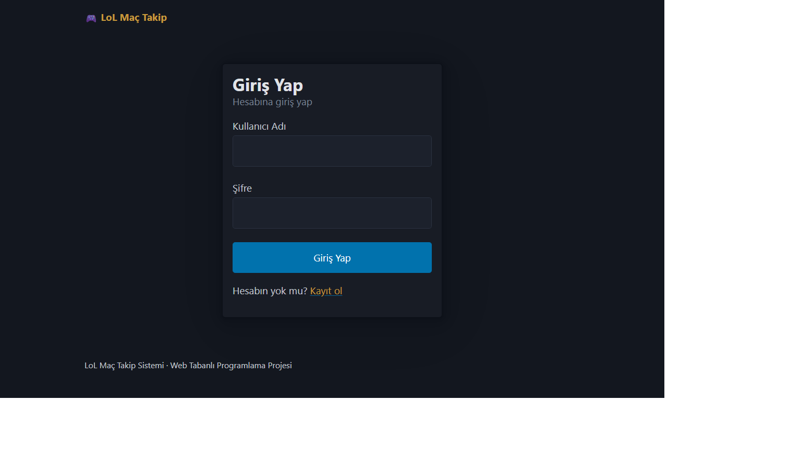
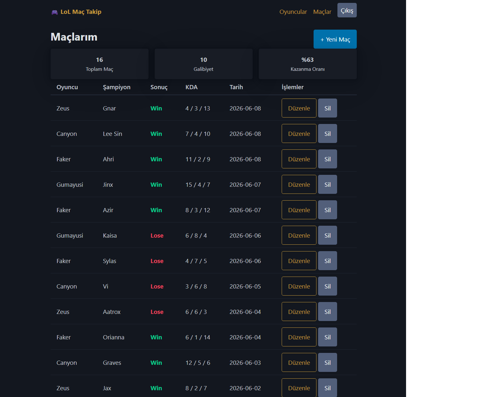

# 🎮 LoL Maç Takip Sistemi

League of Legends oyuncularınızı ve oynadığınız maçları kaydedip takip edebileceğiniz web tabanlı bir uygulama. Kendi oyuncu kadronuzu oluşturup her maçınızı (şampiyon, sonuç, KDA, tarih) ilgili oyuncuya bağlayarak kaydedebilir, kazanma oranınızı görebilirsiniz.

Web Tabanlı Programlama dersi PHP & MySQL projesi olarak geliştirilmiştir.

## Özellikler

- Kullanıcı kaydı ve `password_hash` ile güvenli (hash'lenmiş) şifre saklama
- Session tabanlı oturum açma / kapama
- **Oyuncular** için tam CRUD (ekle, listele, düzenle, sil)
- **Maçlar** için tam CRUD — her maç bir oyuncuya bağlıdır (ilişkili tablolar)
- Toplam maç, galibiyet ve kazanma oranı istatistikleri
- Her kullanıcı yalnızca kendi verilerini görür ve yönetir
- Pico.css ile sade ve responsive arayüz

## Kullanılan Teknolojiler

- PHP (yalın, framework/kütüphane kullanılmadan)
- MySQL / MariaDB
- mysqli (prepared statements ile)
- Pico.css
- HTML5

## Veritabanı Yapısı

Uygulama 3 tablodan oluşur:

| Tablo | Açıklama |
|-------|----------|
| `users` | Kullanıcı hesapları (hash'li şifre) |
| `players` | Kullanıcıya ait oyuncular (summoner adı, rol, rank) |
| `matches` | Bir oyuncuya bağlı maç kayıtları (şampiyon, sonuç, KDA, tarih) |

`players` ve `matches` tabloları `users` tablosuna; `matches` tablosu ayrıca `players` tablosuna foreign key ile bağlıdır. Bir oyuncu silindiğinde ona ait maçlar da otomatik silinir (ON DELETE CASCADE).

## Kurulum

1. `database.sql` dosyasındaki sorguları MySQL veritabanınızda çalıştırın.
2. `includes/Database.php` dosyasındaki bağlantı bilgilerini kendi ortamınıza göre düzenleyin:

```php
private $host = "localhost";
private $user = "root";
private $pass = "";
private $name = "lol_tracker";
```

3. Dosyaları sunucunuza yükleyin ve `index.php` üzerinden uygulamaya erişin.

## Ekran Görüntüleri





## Tanıtım Videosu

(https://youtube.com/shorts/I4PkePpjhKQ?feature=share)

## Geliştirici

GitHub: [omerfarukakay-ofa](https://github.com/omerfarukakay-ofa)
